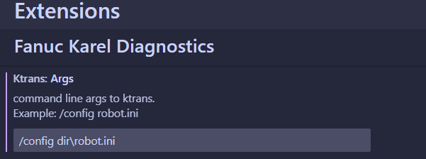
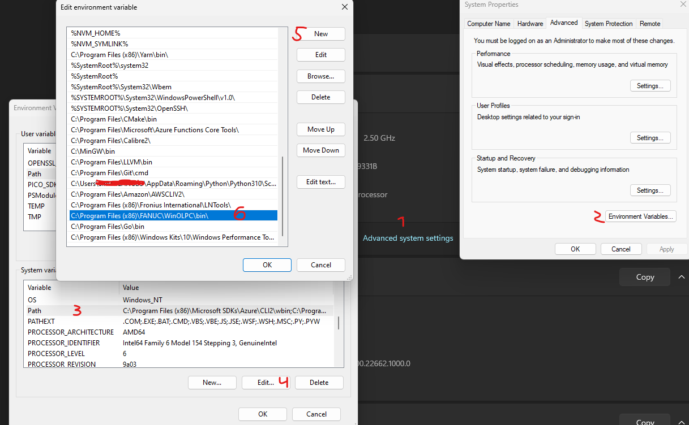

# README
This extension provides [diagnostic information](#example) for Fanuc Karel language in vscode. \
On every save your .kl files are compiled with ktrans, compile errors are then sent to editor.

## Requirements
* Fanuc Roboguide

## Installation
* Install extension from vscode marketplace
* [Add ktrans to path](#add-to-path)

## Settings
* Set command line arguments to 'ktrans' \
(KTrans command is run from the directory of the file you are editing)

### Example

*The extension provides diagnostics when saving karel files   (Inline error messages is "Error Lens" extension)*

### Add to path

*Add to path step by step*

